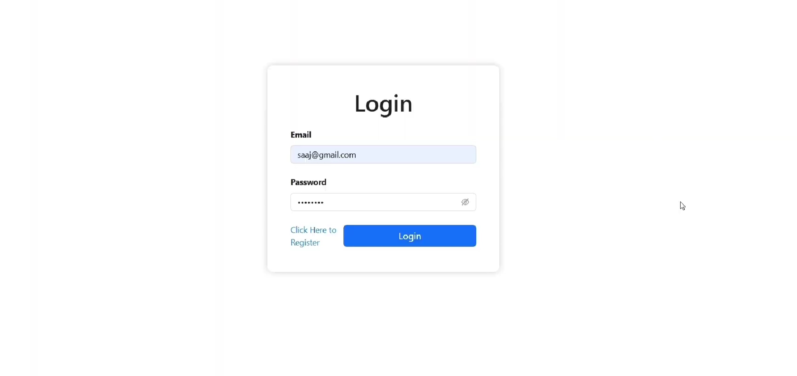
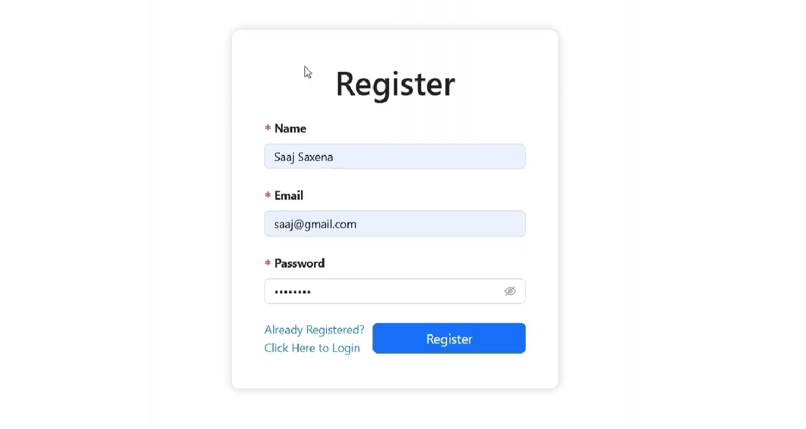
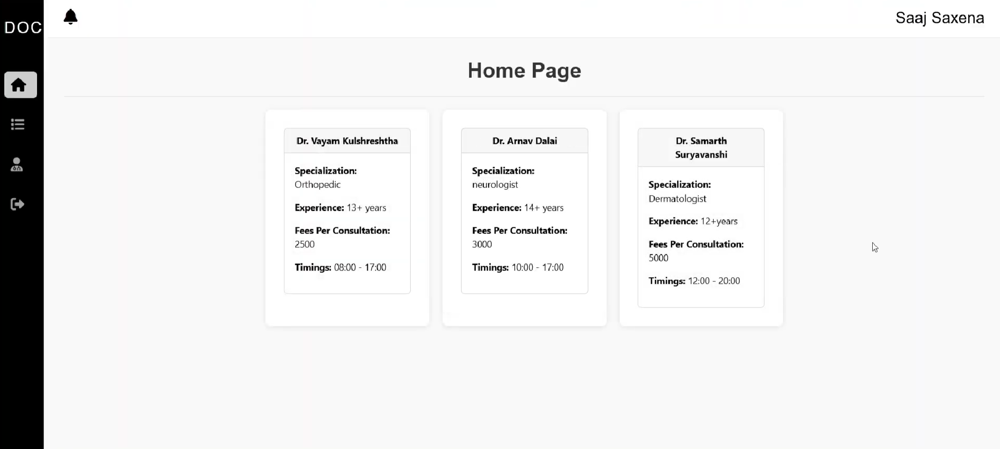
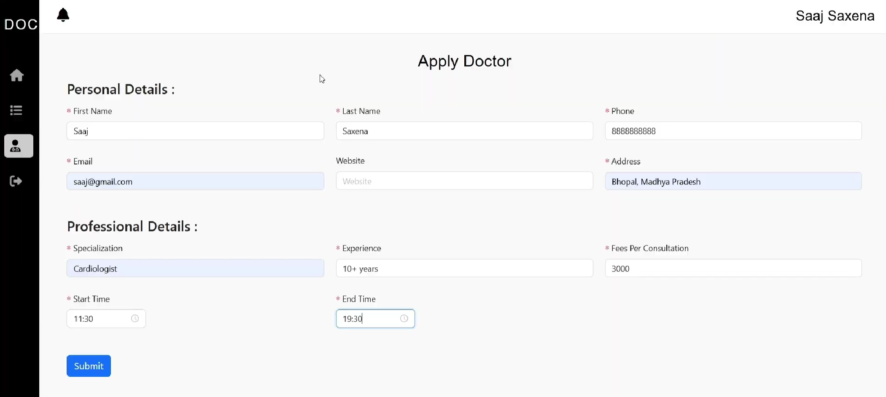
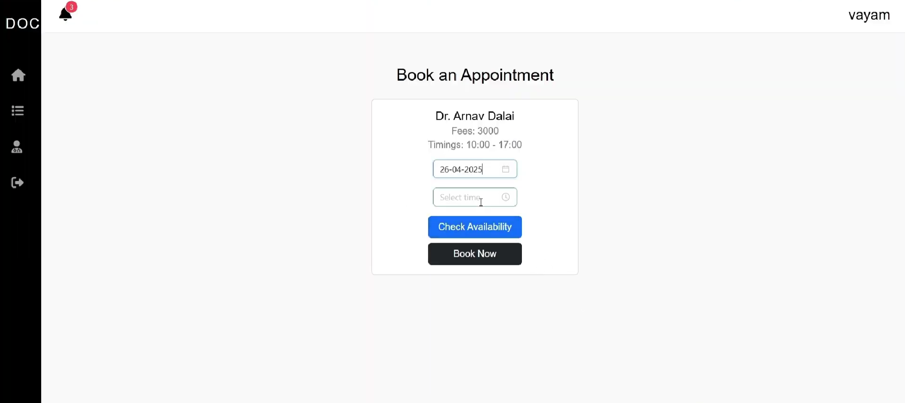

# 🩺 DocSync

**DocSync** is a full-stack web application built using the MERN stack that simplifies doctor appointment bookings. It bridges the gap between patients and healthcare professionals through a secure, real-time, and user-friendly platform.

---

## 🚀 Features

- 👨‍⚕️ Role-based access for Patients, Doctors, and Admins
- 🔐 Secure login with JWT authentication
- 📅 Real-time doctor availability and appointment scheduling
- 📁 Patient medical record storage
- 📊 Doctor and patient dashboards
- 🛡️ Admin panel for managing users and platform activity

---

## 📸 Screenshots

> Screenshots are located in the `Images/` folder:

| Login Page | Registration Page |
|-----------|------------|
|  |  |

| Home Page | Applying Doctor Screen |
|----------------|----------------|
|  |  |

| Booking Screen |
|------------------|
|  |

---

## 🧱 Tech Stack

| Layer      | Tech                            |
|------------|----------------------------------|
| Frontend   | React.js, Tailwind CSS, Axios   |
| Backend    | Node.js, Express.js, JWT        |
| Database   | MongoDB Atlas, Mongoose         |
| Deployment | Vercel (Frontend), Render (API) |

---

## 📂 Project Structure

```bash
/docSync
│
├── client         # Frontend React app
└── server files
